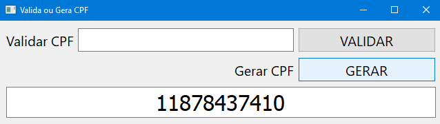

# Validador e Gerador de CPF com Python e PyQT5
>Programa que valida e gera CPF's válidos

Esse código foi realizado juntamente com o curso de Python da Udemy e tem como objetivo dizer se um CPF é válido e também gerar CPF's válidos.

__**Note que a validação é realizada apenas matematicamente, não sendo necessáriamente relacionados à uma pessoa física.__


## Exemplo de Uso
### Validação de CPF
Basta digitar um CPF no campo "Validar CPF" e clicar o botão "VALIDAR"; a resposta será gerada logo abaixo


### Geração de CPF válido
Basta clicar no botão "GERAR" que será gerado um CPF válido logo abaixo



## Ambiente de Desenvolvimento

Para a aplicação funcionar corretamente deve-se instalar (além do Python), o Módulo PyQt5 através do comando:

```shell
    pip install pyqt5
```

## Meta

Bruno Augusto --- [Linkedin](https://www.linkedin.com/in/brunoaugp/) --- brunoaugp@hotmail.com

<https://github.com/brunoaugp>


